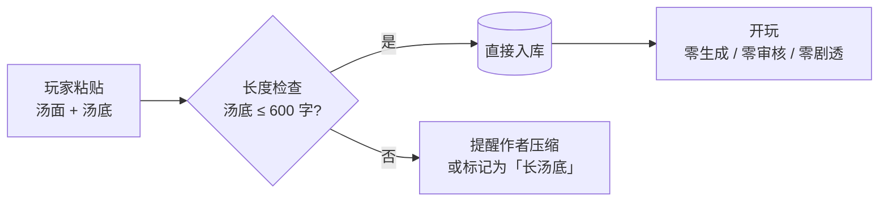

# AI 海龟汤主持人 · 项目实施文档

> 用途：**项目交接文档**。可直接作为新会话的起点，读完即可开工。

---

## 0. 给接手的 AI 的说明

这份文档是**已完成调研和决策**的结果，不是待讨论的草案。

- **§2 已定决策**：不要重新论证、不要推翻。除非有实测数据支撑，否则照做。
- **§5 API 事实**：已经查证过的官方文档内容，可直接照抄进代码。里面的 URL 是权威来源。
- **§10 避坑清单**：明确列出**已经被否决的方案**，不要再提。
- **§12 待验证清单**：这是唯一需要动手验证的部分，优先做。

如果发现文档里有矛盾或事实性错误，先指出来，不要默默改设计。

---

## 1. 项目目标与范围

### 1.1 做什么

一个 AI 当主持人的海龟汤游戏：

- 玩家看汤面，自由输入是非问句
- AI 实时回答「**是 / 不是 / 是也不是 / 无关**」
- 玩家卡住可以要提示
- 玩家自认解开时可以提交答案，系统判定是否通关
- **支持导入任意题库**（玩家粘贴自己的汤面+汤底即可玩）

### 1.2 不做什么（第一期）

- 不做语音（后续可选）
- 不做多人协作
- 不做本地模型推理
- 不做移动客户端

### 1.3 成功标准

| 指标 | 目标 |
|---|---|
| 判定准确率 | > 90% |
| **致命错误率**（该答"不是"却答"是"） | **< 2%** |
| 弃权率 | 5%–15% |
| 通关判定准确率 | > 97% |
| 提示剧透率 | **0** |
| P50 延迟 | < 500ms |
| **每局成本（50 问）** | **< ¥0.02** |

> 致命错误率单独统计。海龟汤里判错方向的代价远大于不回答：漏判玩家再问一次，误判直接把谜题带进沟里。**不要只看总准确率。**

---

## 2. 已定决策（不要再讨论）

| # | 决策 | 理由 |
|---|---|---|
| D1 | **判定层用 Jev** | 输出结构受约束（零格式错误）、**校准概率**（可做弃权阈值）、70–500ms、输出免费 |
| D2 | **语言处理层用 DeepSeek** | 中文强、便宜、可按需触发。它负责把口语变规整，不做判定 |
| D3 | **❌ 不做本地 NLI / 本地小模型** | ① 输入开放，NLI 召回上限被要素表覆盖率锁死 ② 海龟汤核心是间接推理，NLI 是单步句对蕴含 ③ 玩家说口语，中文 NLI 语料偏书面 ④ 调试时"要素表漏了/NLI 判反了/阈值歪了"三变量纠缠 ⑤ 它唯一的优势是免费，而免费不是瓶颈 |
| D4 | **❌ 不做"中文→英文翻译后再给 Jev 判定"** | ① 误差变乘法 ② 要素表对齐被破坏 ③ 吃掉 Jev 的速度优势 ④ 成本翻 2–4 倍（DeepSeek 输出计费、Jev 输出免费） ⑤ **不解决真短板**：Jev 的弱项是 `indirect reasoning`（架构层，与语言无关）；⑥ 本质是"用中文强的模型给中文弱的模型打下手"，那不如让中文强的直接干 |
| D5 | **❌ 不做"在线 DeepSeek 召回要素 → 再交给 Jev"** | 召回是**单选**，命中 A 就丢 B，复合提问必然被截断。Jev 一次请求里所有 Noul **并行评估**、输出又免费，所以"多问几条"的边际成本只是输入 token。用 DeepSeek 先单选召回，既花钱又制造漏判 |
| D6 | **❌ 不做「要素表」** —— 不生成、不留字段、不留模块、不留预处理 | ① 典型汤底 100–400 字，直读汤底**更便宜** ② 生成要素表要预处理 + 每轮 token 更高，是净支出 ③ 审核会剧透 ④ 提示与通关都有不依赖要素表的替代方案 |
| D6b | **四态规则表必须保留**（纯代码，约 50 行） | 无论用哪个后端，「是也不是」都只能由代码产生 |
| D7 | **"是也不是"由代码产生**，不由模型产生 | 任何模型都给不出稳定的"部分成立"判断。多命中 + 规则表是唯一可靠来源 |
| D8 | **"拿不准"必须是合法输出**（弃权） | 防误判。弃权时不能说"无关"，那是一个错误的断言 |
| D9 | **回答只用模板**，禁止自由生成 | 自由生成必然剧透。主持人口吻的改写必须带引用校验，越界回退模板 |
| D10 | **题库导入 = 直接入库**，只做汤底长度检查 | 零生成、零审核 → 零剧透风险。见 §4.7 |
| D11 | **逐条 Noul，禁止用 Choice 做要素匹配** | Choice 是单选，架构上就会漏信息 |
| D12 | **在线关掉 DeepSeek 思考模式** | reasoning token 按输出计费，成本翻几倍 |
| D13 | **Jev 固定版本号，不用 `jev-latest`** | alias 会随版本移动，判定行为会悄悄变化 |
| D14 | **批量导入的题库：零预处理、零审核、零剧透** | 玩家导题库是为了自己玩；让他先审一遍等于先剧透一遍 |
| D15 | **❌ 不做「玩后修判定表」** | 玩家不会为了一局游戏去改判定表。反馈只作为开发者侧日志，不进玩家流程 |
| D16 | **通关判定 = 玩家复述汤底 + 一个 Noul** | 「判断什么最重要」是 AI 最不可靠的能力。改成「玩家的复述是否解释了汤底」——明确且可验证 |
| D17 | **保留的唯一抽象：判定后端可替换**（Jev / DeepSeek） | 与要素表无关。理由是 Jev 的中文能力未知，必须能一键切换。成本为零 |

---

## 3. 总体架构

### 3.1 在线主链路

```
玩家提问
   ↓
[本地规则层] 意图识别（是非提问 / 求提示 / 提交答案 / 闲聊）—— 正则，0 成本
   ↓
[可选] DeepSeek 语言处理层 —— 仅在检测到复合句/歧义/异常时触发
   ↓
[Jev 判定层] 对同一份 state 问 3 个 Noul，一次请求并行
   ↓
[代码] 四态映射表 + 双阈值弃权
   ↓
[模板] 「是。」/「不是。」/「是，也不是。」/「无关。」
   ↓
[代码] 更新本局已问过的对话 → 供提示生成与通关判定使用
```

### 3.2 可替换的判定后端（唯一的抽象）

**没有「两条知识路线」。只有一条路线（直读汤底）+ 两个可替换的后端。**

| | **后端 A：Jev**（✅ 主力） | **后端 B：DeepSeek**（⚠️ 备用） |
|---|---|---|
| 定位 | 默认 | Jev 中文实测不达标时切换 |
| 输出 | 结构化值（`noul` 概率），零格式错误 | 需 JSON 约束 + 自报置信度 |
| 弃权依据 | **校准概率** | 自报 confidence，可靠性低一档 |
| 速度 | 70–500ms | 更慢（自回归） |
| 成本 | 输入 $0.042/M、输出免费 | 输入 + 输出都计费 |
| 中文 | ⚠️ 官方称 CJK "not equally well" | ✅ 强 |

**为什么留这个抽象：** 成本为零（一个接口 + 两个实现），但它是**唯一能让项目在
「Jev 中文不行」这个最大风险上不翻车**的东西。§12 决策门一旦触发，改一行配置即可切换。

**成本（一局 50 问、1000 局，按汤底 300 字）**

| 组成 | 每轮 token | 1,000 局 |
|---|---:|---:|
| Jev 判定（3 个 Noul，直读汤底） | ~810 in | **¥12** |
| 提示生成（DeepSeek，约 3 次/局） | — | ¥2–6 |
| 通关判定（Jev 1 个 Noul，约 2 次/局） | — | ¥1 |
| **合计** | | **~¥16** ✓ |

> 汤底长度直接决定判定成本：`每轮 token ≈ 1.5 × 汤底字数 + 360`。
> 建议在导入时限制汤底 ≤ 600 字（对应约 ¥24 / 1000 局）。

---

## 4. 核心机制

### 4.1 Jev 判定层（直读汤底）

一次请求，三个 Noul：

```
state = {
  "surface": 汤面,
  "truth":   汤底全文,
  "player_question": 玩家原话
}

questions = {
  "holds":     {"type":"noul", "instructions":
                 "根据 `truth`，`player_question` 所描述的事情是真的吗？"},
  "fails":     {"type":"noul", "instructions":
                 "根据 `truth`，`player_question` 所描述的事情是假的吗？"},
  "relevant":  {"type":"noul", "instructions":
                 "`truth` 是否涉及了 `player_question` 所问的这件事？"}
}
```

> 注意：`player_question` 放进 `state` **一次**，不要在每条 instructions 里重复 ——
> 重复会成倍放大输入 token，而 Jev 是按输入计费的。用反引号引用 state 里的字段名即可。

### 4.2 四态映射（纯代码，约 50 行，永不随汤底变化）

**四态映射：**

```
relevant < LOW                                  → 无关 / 或弃权（见 §4.3）
holds ≥ HIGH 且 fails ≤ LOW                     → 是
fails ≥ HIGH 且 holds ≤ LOW                     → 不是
holds ≥ HIGH 且 fails ≥ HIGH                    → 是，也不是
其余（全在灰区）                                 → 弃权
```

**关键：`holds` 和 `fails` 是两条独立的问题，不是一条问题的两个选项。**
所以「是也不是」不需要模型去判断"部分成立"——它只是 `holds` 和 `fails` 同时高。

**为什么这段必须是代码：** 玩家问"他打嗝，而且是因为口渴才要水吗？"
→ Jev 判出 `holds` 0.90（打嗝是真的）+ `fails` 0.85（口渴要水是假的）
→ 代码得出「**是，也不是**」。

模型只回答"这两件事各自成不成立"，"合起来是什么意思"由代码决定——永远可测、可复现。

### 4.3 弃权机制

**双阈值三档：**

```
P ≥ HIGH (默认 0.80)  → 确认成立
P ≤ LOW  (默认 0.20)  → 确认不成立
LOW < P < HIGH        → 灰区，不参与判定；若整个问题都在灰区 → 弃权
```

弃权话术（**关键：不能说"无关"**）：

> "这个我不太确定，你能换个说法再问一次吗？"

副作用是好的：灰区样本自动变成日志里最有价值的标注素材，用来调阈值、调提示策略。

**目标弃权率 5%–15%。** 低于 5% 说明在硬猜；高于 20% 说明覆盖不足。

### 4.4 语言处理层（DeepSeek）—— 可插拔

**成本纪律：不是每轮都调。** DeepSeek 输出按 token 计费（$1.20/M），每轮调用会吃掉全部预算。
只在**本地规则层搞不定**时触发（预计 < 20% 的轮次）。

| 任务 | 触发条件 | 输入 | 输出 | 备注 |
|---|---|---|---|---|
| **复合问题拆解** | 检测到「并且/而且/同时/或者」 | 提问 ~30 tok | 子问题列表 ~60 tok | 拆开后每个子问题独立走 Jev，再合并四态 |
| **指代消解** | 检测到「他/她/它/那个人」 | 提问 + 最近 2 轮 | 消解后的句子 ~50 tok | |
| **意图分类** | 关键词规则不确定时 | 提问 | 一个枚举值 ~10 tok | 是非提问 / 求提示 / 提交答案 / 闲聊 |
| **提示生成** | 玩家点「提示」时 | 汤底 + 本局已确认的对话 | 一句不剧透的提示 ~40 tok | **生成后用 Jev 一个 Noul 自检是否过度剧透**，是则重生成 |
| **通关判定** | 玩家提交复述时 | —— | —— | **改用 Jev 的 Noul**，更便宜也更可靠，见 §4.5b |
| **主持人口吻改写** | 需要时（可延后） | 模板回答 + 本局已确认的对话 | 改写结果 + **引用片段** | **必须校验：出现的实体须被引用覆盖，越界回退模板** |

> 统一用 JSON 输出（`response_format={"type":"json_object"}`），在线一律关思考模式。

### 4.5 提示机制（在线按需生成）

玩家点「给点提示」时才调一次 DeepSeek：

```
state = {
  "truth": 汤底,
  "confirmed_so_far": 本局玩家已经猜对的内容,
  "task": "给一句能引导他继续问下去的提示。不要直接说出汤底的核心答案。"
}
```

**防剧透两道闸：**

1. **生成后自检**（Jev 一个 Noul）：「这条提示是否直接说出了 `truth` 的核心？」
   → 是则丢弃重生成（最多 2 次）
2. **兜底**：2 次都不过 → 退回一个**通用提示池**（零成本、零剧透）：
   > "试试从物品入手？""想想他为什么会说谢谢？""注意时间顺序。"

**成本**：约 3 次/局 → **¥2–6 / 1000 局**（固定前缀吃缓存命中价，命中价是未命中的 1/50）。

同一局不重复给同一条提示，落库记录。

### 4.5b 通关判定（不依赖「要素」）

```
玩家提交复述：「男人在打嗝，酒保拔枪是为了吓他一跳，嗝就停了」

→ Jev 一个 Noul：
   state = { truth, player_solution }
   instructions = "`player_solution` 是否解释了 `truth` 的核心疑问？"

→ >0.80       通关
   0.40–0.80   「方向对了，但还差一点」
   <0.40       「还没解开」
```

**为什么不用「哪些要素最重要」来判通关：** 那是 AI 最不可靠的能力（判断"什么重要"）。
而"玩家的复述是否解释了汤底"是一个明确的、可验证的语义任务，还能被人工标注验证。

**成本**：只在提交时调，约 2 次/局 → **¥1 / 1000 局**。

### 4.6 回答模板（禁止自由生成）

```python
VERDICT_LABEL = {"yes": "是", "no": "不是", "both": "是，也不是", "irrelevant": "无关"}

def render_reply(verdict, reason=""):
    if verdict == "irrelevant": return "无关。这个和本案没有关系。"
    if verdict == "both":       return f"是，也不是。{reason}" if reason else "是，也不是。"
    if verdict is None:         return "这个我不太确定，你能换个说法再问一次吗？"
    return f"{VERDICT_LABEL[verdict]}。"
```

要更自然的主持人口吻，就套一层**受限改写**，但结果必须携带被引用的汤底片段，
由代码校验"出现的实体是否被引用覆盖"，越界就回退模板。

### 4.7 题库导入（零预处理）

**粘进来就能玩。没有中间产物，就没有可剧透、可出错、可维护的东西。**



**三项自动检查（全是代码，不需要人读）：**

| 检查 | 目的 | 失败时 |
|---|---|---|
| 汤底长度 | 成本与精度都与汤底长度挂钩（见 §7） | 提醒作者压缩，仍可入库 |
| 汤底非空 / 汤面非空 | 防垃圾数据 | 拒绝入库并报错 |
| 重复导入检测 | 同一汤不要反复入库 | 提示已存在 |

**为什么不离线生成「要素/要点」，也不做人工审核：**

| | 生成中间产物 | 直接入库（✅ 本文档方案） |
|---|---|---|
| 预处理成本 | 每汤一次 AI 调用 | **0** |
| 每轮判定 token | 更高（要素表要重发） | 更低（短汤底时） |
| 审核 | 审了就等于提前剧透自己 | **无需审核** |
| 批量导入 100 个汤 | 100 次预处理 + 审核人力 | **粘贴即完** |
| 出错面 | 中间产物 + 判定两处 | **只有判定一处** |

---

## 5. API 事实（已核实，可直接照抄）

### 5.1 Jev / TypeSafe

**Endpoint**

```http
POST https://api.typesafe.ai/v1/systemone
Authorization: Bearer <TYPESAFE_API_KEY>
Content-Type: application/json
```

**请求体**

```json
{
  "state": "字符串 | 对象 | 数组",
  "model": "jev-1.13.0",
  "questions": {
    "我的问题id": {
      "type": "noul",
      "instructions": "是非问题，或一句待判断的陈述",
      "criteria": { "true": "什么情况算「是」", "false": "什么情况算「否」" }
    }
  }
}
```

**响应体**

```json
{
  "model": "jev-1.13.0",
  "answers": {
    "我的问题id": { "type": "noul", "noul": 0.95 }
  },
  "usage": { "input_tokens": 296, "output_tokens": 20 }
}
```

**三种问题类型**

| type | 用途 | 返回字段 |
|---|---|---|
| `noul` | 是非判断 | `noul`：0–1 的「是」的概率（**没有单独的 confidence，这一个数就是全部信息**） |
| `choice` | 从你定义的选项里选一个（**最多 255 个选项**） | `choice`（最高概率项）、`probabilities`（全分布）、`confidence` |
| `score` | 有序等级打分（2–10 级） | `score`（加权位置，可落在两级之间）、`legend`、`probabilities`、`confidence` |

**`instructions` 可以是对象**，把问题和它引用的数据分开写，用反引号引用字段名：

```json
"instructions": {
  "player_question": "...",
  "claim_text": "...",
  "question": "`player_question` 和 `claim_text` 说的是同一件事吗？"
}
```

**❌ 重要限制：Jev 不支持嵌套 JSON 输出。** 需要嵌套结构就用多个独立问题 + 代码组装。

**关键参数**

| 项 | 值 |
|---|---|
| 输入价格 | **$0.042 / 1M token** |
| 输出价格 | **免费** |
| 上下文 | 64k（state + 全部问题）；32k（state + 最长的一个问题） |
| 限流 | 100K tok/s、80 req/s（**官方声明动态调整**） |
| 输入类型 | **仅文本**（不支持图/音/视频） |
| 语言 | 英文为主要训练语言，CJK "handled but **not equally well**" |
| 并行 | 同一请求里所有问题**并行评估**，加问题几乎不增加延迟 |

**错误码**：`401` 密钥错 · `422` 请求体校验失败 · `429` 超限流 · `529` 服务过载
→ `429`/`529` 用指数退避重试。

**官方已知弱项**（`docs.typesafe.ai/model-jaggedness/jev-1.13`）：
字面措辞、数值精度、**日期比较**、**间接推理**、无关上下文、恶意输入、冲突指令。

> ⚠️ 海龟汤的核心恰恰是间接推理。所以**不要让 Jev 承担推理**：
> 把推理拆成多条独立的是非判断，逐条交给 Jev 做语义匹配；
> "合起来是什么意思"由代码决定。这也是为什么四个问题是分开问的，而不是问一整句。

**不开源、无自托管**：官方文档明确 "the same weights serve every account"，不支持按账号微调/LoRA。企业版才提 on-premise，需联系销售。

**免费额度**：无。只有 14 天试用。

### 5.2 DeepSeek

**Endpoint**（OpenAI 兼容）

```python
from openai import OpenAI
client = OpenAI(api_key=..., base_url="https://api.deepseek.com")
```

**模型名**：`deepseek-flash`（= DeepSeek-V4.1-Flash）
> 旧名 `deepseek-v4-flash` 已退役，请求由 V4.1-Flash 承接并按 Flash 计价。

**上下文** 1M ｜ **最大输出** 384K ｜ 支持 JSON 输出、工具调用、前缀补全、Vision

**⚠️ 关闭思考模式**（默认是开启的）：

```python
client.chat.completions.create(
    model="deepseek-flash",
    messages=[...],
    response_format={"type": "json_object"},
    extra_body={"thinking": {"type": "disabled"}},   # ← 关键
)
```

- 思考模式的 CoT 走 `reasoning_content` 字段，与 `content` 同级
- 思考模式下**不支持** `temperature` / `presence_penalty` / `frequency_penalty`（设了也不报错，但无效）
- 非思考模式下 `top_p` 被固定为 1.0
- 未带 `tools` 参数时，`reasoning_content` 不需要回传，回传也会被忽略
- `reasoning_effort` 可选：`minimal` / `low` / `medium` / `high` / `xhigh` / `max`

**价格（USD / 1M token）**

| 模型 | 输入（缓存命中） | 输入（未命中） | 输出 |
|---|---|---|---|
| `deepseek-flash` 高峰 | $0.006 | $0.30 | $1.20 |
| `deepseek-flash` 低谷 | $0.003 | $0.15 | $0.60 |
| `deepseek-v4-pro` 高峰 | $0.044 | $1.32 | $3.96 |
| `deepseek-v4-pro` 低谷 | $0.022 | $0.66 | $1.98 |

**高峰时段**：UTC 01:00–04:00 与 06:00–10:00，周一至周五
→ **北京时间 9:00–12:00、14:00–18:00**
→ 其余时段（**含晚上、周末、中国节假日**）**全部半价**

> 玩家晚上玩，天然打折。上线时可在代码里按 UTC 判断时段做成本估算。

**缓存**：固定前缀（系统提示 + 汤底）会自动命中缓存，命中价是未命中的 **1/50**。
→ 汤底、系统提示放在 prompt 最前面且保持稳定。

### 5.3 ⚠️ 网络预检（P0 第一件事）

本机实测（2026-09-30）：`github.com` / `huggingface.co` **直连不通**；`pypi.org` 可直连；
开发机可走本地代理；但 **WinHTTP 是直连、无 `*_PROXY` 环境变量**
→ `git` / `pip` / `conda` 默认**不走系统代理**。

**必须实测**：
- `api.deepseek.com`（国内服务，预期直连可用）
- **`api.typesafe.ai`（美国服务，连通性未知，必要时需要走代理）**

若 Jev 需要代理，在代码里给 `httpx` 显式配 `proxy=`，**不要依赖系统代理**。

---

## 6. 数据格式

### 6.1 soup.json（只有四个必需字段）

```json
{
  "id": "soup_demo",
  "title": "酒吧里的那把枪",
  "surface": "男人走进酒吧要了一杯水，酒保却拔枪指着他……",
  "truth": "男人在打嗝，怎么都停不下来，所以想讨杯水压一压。酒保一眼就看出他在打嗝，于是拔枪吓他一跳——突然的惊吓正好能止住打嗝。嗝停了，男人明白酒保是在帮他，所以道谢离开。那把枪里其实没有子弹。",
  "win_text": "你解开了：男人在打嗝，酒保拔枪是为了吓他一跳来止嗝。（可选，仅用于通关后的展示）"
}
```

| 字段 | 必需 | 作用 |
|---|---|---|
| `id` | ✅ | 唯一标识 |
| `title` | ✅ | 列表里显示的名字 |
| `surface` | ✅ | 汤面（玩家能看到的谜题） |
| `truth` | ✅ | 汤底。**直接进入每轮判定**，所以长度直接影响成本与精度 |
| `win_text` | ❌ | 通关后的揭示文案 |

> **没有 `claims` 字段。** 不需要要素表、不需要依赖图、不需要预生成提示。
> 提示和通关判定都是在线按需的（§4.5 / §4.5b）。

**汤底写法建议（影响精度）：**

- 长度 100–400 字最佳（成本最低、`irrelevant context` 干扰最小）
- 把因果关系写清楚（「因为 A，所以 B」），不要只写现象
- 涉及否定、数字、日期时写明确（这些是 Jev 的已知弱项，写模糊了更容易错）

### 6.2 回合记录（每问一行，JSONL）

```json
{
  "ts": 1759500000.0,
  "game_id": "a1b2c3d4",
  "turn": 7,
  "question": "他是打嗝了吧？",
  "nlu": { "intent": "yes_no", "decomposed": null, "rewritten": null },
  "verdict": "yes",
  "scores": { "holds": 0.94, "fails": 0.03, "relevant": 0.97 },
  "abstained": false,
  "flags": [],
  "usage": { "jev_in": 612, "deepseek_in": 0, "deepseek_out": 0, "cost_usd": 0.0000257 },
  "latency_ms": 340
}
```

**灰区样本要单独落一份**，它们是调阈值的最好素材。

---

## 7. 成本模型

### 7.1 预算约束

**目标：1,000 局 ≤ ¥20** → 每局 ≤ ¥0.02（≈ $0.0028）

### 7.2 公式

```
每轮 Jev 输入 token ≈ 汤底字数 × 1.5 + 汤面 + 提问 + 3 个 Noul 的指令 ≈ 1.5 × 汤底字数 + 360
判定成本 / 1000 局 ≈ 每轮 token × 50 问 × 1000 局 / 1e6 × $0.042 × 7.2
                   = 每轮 token × 0.01512
```

### 7.3 按汤底长度的成本

| 汤底字数 | 每轮 token | 判定 / 1000 局 | 加提示与通关 | 合计 |
|---|---:|---:|---:|---:|
| 100 字 | ~510 | ¥8 | +¥3–7 | **¥11–15** |
| 200 字 | ~660 | ¥10 | +¥3–7 | **¥13–17** |
| **300 字（典型）** | **~810** | **¥12** | **+¥3–7** | **¥15–19** ✓ |
| 400 字 | ~960 | ¥15 | +¥3–7 | ¥18–22 ⚠️ |
| 500 字 | ~1,110 | ¥17 | +¥3–7 | ¥20–24 ❌ |
| 800 字 | ~1,560 | ¥24 | +¥3–7 | ¥27–31 ❌ |
| 1,200 字 | ~2,160 | ¥33 | +¥3–7 | ¥36–40 ❌ |

**结论：汤底 ≤ 约 400 字时，整个方案稳定在 ¥20 / 1000 局以内。**
→ 所以 §4.7 建议导入时限制汤底 ≤ 600 字（上限，对应约 ¥24）。

### 7.4 其他成本项

| 项 | 成本 | 说明 |
|---|---|---|
| 提示生成（DeepSeek，约 3 次/局） | ¥2–6 / 1000 局 | 固定前缀吃缓存命中价（1/50） |
| 通关判定（Jev 1 个 Noul，约 2 次/局） | ¥1 / 1000 局 | |
| 按需 NLU（拆解 / 指代，< 20% 轮次） | ¥3–5 / 1000 局 | 可关（`NLU_*=0`） |
| **离线预处理** | **¥0** | **本方案没有离线预处理** |
| 题库导入 | **¥0** | 直接入库，不调用任何模型 |
| ~~不关 DeepSeek 思考模式~~ | ~~¥470~~ ❌ | reasoning token 按输出计费 |

### 7.5 成本纪律（必须写进代码）

1. 在线**一律关思考模式**：`extra_body={"thinking":{"type":"disabled"}}`
2. Jev 的 `state` 里放一份 `player_question`，**不要在每条 instructions 里重复**
3. 提示与 NLU 都**按需触发**，不做每轮调用
4. DeepSeek 输出**尽量短**（只输出那一句话，不要解释）
5. 固定前缀放 prompt 最前面，吃 DeepSeek 的缓存命中价
6. 导入时**限制汤底长度 ≤ 600 字**（这是唯一能有效控本的手段）
7. 超预算时第一刀砍**按需 NLU**（它最可选），第二刀砍**在线提示**（改通用提示池）

---

## 8. 模块划分与实施步骤

### 8.1 建议的目录结构

```
turtle-soup/
├── app.py                    FastAPI 入口
├── config.py                 读 .env、价格表、阈值
├── soup/
│   ├── models.py             Soup / Turn / Verdict / Usage
│   ├── rules.py              四态映射表（纯代码，核心）
│   ├── pricing.py            成本折算（含高峰时段判断）
│   ├── engine.py             游戏状态机
│   ├── hints.py              提示生成 + 防剧透自检 + 通用提示池
│   ├── solve.py              通关判定（玩家复述 + 1 个 Noul）
│   ├── nlu/                  语言处理层
│   │   ├── intent.py         本地正则意图识别（0 成本）
│   │   ├── decompose.py      DeepSeek 复合问题拆解（按需）
│   │   └── coref.py          DeepSeek 指代消解（按需）
│   └── backends/
│       ├── base.py           统一接口
│       ├── jev_direct.py     Jev 直读汤底（默认）
│       └── deepseek_direct.py DeepSeek 直判（备用）
├── eval/
│   ├── labels.csv            标注集
│   └── run_eval.py           评测与对比
├── data/                     *.json 题库（只有四个字段）
├── web/                      index.html
└── logs/                     回合日志（JSONL）
```

> **注意：没有 `import/` 目录，也没有 `jev_elements.py`。**
> 题库直接入库，不生成任何中间产物。

**后端统一接口**（换后端不改下游）：

```python
class JudgeBackend:
    name: str
    def judge(self, question: str, soup: Soup, history: list[Turn]) -> JudgeResult:
        """返回 JudgeResult(scores, usage, latency_ms, note, debug)
        scores = {"holds": float, "fails": float, "relevant": float}
        """
```

`rules.decide()` 完全不知道后端是谁 —— 这就是切换与对比的成本为零的原因。

### 8.2 里程碑

| 阶段 | 内容 | 工期 | 决策门 |
|---|---|---|---|
| **P0** | ① 网络预检（§5.3）② 标注 30–50 题 ③ 定稿 soup.json 四字段与四态定义 | 1 天 | 网络不通 → 先解决代理 |
| **P1** | 最小可玩：Jev 直读汤底 + 弃权 + 四态模板 + 网页原型 | 1–2 天 | **决策门：致命错误率 ≥ 2% → 切后端 B（DeepSeek）** |
| **P2** | 题库导入（直接入库）+ 多汤管理 + 回合日志 | 1–2 天 | 批量导入 100 个汤是否能一次粘完 |
| **P3** | 提示生成（含防剧透自检）+ 通关判定 | 2 天 | 提示剧透率是否保持 0 |
| **P4** | 按需 DeepSeek NLU（拆解 / 指代）+ 成本核对 | 2 天 | 是否仍在 ¥20/1000 局内 |
| **P5** | 客户端 / 题库广场 / 多人模式 | — | — |

**建议严格从 P0 开始。** P1 的核心目的不是"做出游戏"，而是**用一个下午同时验证两件事**：
① Jev 的连通性与中文能力；② 直读汤底的实际精度。

**如果 P1 决策门触发（精度不达标），备选方案的尝试顺序：**

| 顺序 | 措施 | 成本 | 需不需要预处理 |
|---|---|---|---|
| 1 | 调弃权阈值（更保守，宁可弃权） | 0 | 否 |
| 2 | 限制汤底长度（≤ 400 字） | 0 | 否 |
| 3 | 换后端 B（DeepSeek 直判） | 成本略升 | 否 |
| 4 | 复杂提问先由 DeepSeek 拆解再交给 Jev | ¥3–5 / 1000 局 | 否 |
| 5 | ⚠️ 最后手段：要素化（见附录 B） | 预处理 + 每轮 token 升高 | **是** |

前 4 项都不需要任何预处理，所以先试完它们再说。

---

## 9. 评测方案

### 9.1 标注集

先手工标 30–50 题（针对一条汤），列：`question, expected_verdict, note`
- `expected_verdict` ∈ `yes / no / both / irrelevant`
- `note` 里标注"汤底未覆盖"的题，单独统计

### 9.2 指标

| 指标 | 目标 | 说明 |
|---|---|---|
| 判定准确率 | > 90% | |
| **致命错误率** | **< 2%** | 该答 `no` 却答 `yes`。**单独统计，不平摊** |
| 反向致命错误率 | < 5% | 该答 `yes` 却答 `no` |
| 弃权率 | 5%–15% | |
| 通关判定准确率 | > 97% | 玩家已解开但系统没识别 |
| 提示剧透率 | **0** | 由「生成后自检 + 通用提示池兜底」保证 |
| 延迟 P50 / P95 | < 500ms / < 1.5s | |
| 每局成本（汤底 300 字） | < ¥0.02 | |

### 9.3 对比设计

**同一批标注题、同一套 harness（规则表 + 弃权），只换判定后端：**

| 组 | 说明 |
|---|---|
| ① **Jev 直读汤底** | 默认基线 |
| ② DeepSeek 直判（关思考 + JSON 约束 + 自报置信度） | 当 Jev 中文不达标时的备用方案 |

输出：逐题对照表 + 混淆矩阵 + 成本延迟对比。

> **不要只看总准确率 —— 致命错误率才决定成败。**
> 另：组 ② 没有校准概率，只能让它自报 confidence，可靠性低一档。**首选仍是 Jev。**

### 9.4 分长度评估（必做）

同样的标注题，分别在 100 字 / 300 字 / 800 字汤底上跑一遍。

目的：确认 `irrelevant context` 弱项的实际影响拐点，用以定下 §4.7 的长度上限。

---

## 10. 避坑清单（明确不做）

| ❌ 不做 | 原因 |
|---|---|
| **要素表 / 依赖图 / 预生成提示阶梯** | D6：典型汤底 100–400 字时直读汤底更便宜；生成要素表是净支出，且审核会剧透 |
| **要求玩家审核或修正判定表** | D15：玩家不会为了一局游戏去改表，也不懂该改哪条 |
| 本地 NLI / 本地小模型作为主力判定 | D3 五条理由 |
| 中文→英文翻译后再给 Jev | D4：误差乘法、破坏对齐、吃掉速度优势、成本翻倍、**且不解决真短板** |
| 在线 DeepSeek 召回要素 → 再交给 Jev | D5：召回是单选，会漏要素 |
| 让 Jev 承担"推理" | 官方已知弱项 `indirect reasoning`（架构层，与语言无关） |
| 用 `key` / `importance` 让 AI 判"什么最重要" | D16：这是 AI 最不可靠的能力。通关改用"玩家复述" |
| 自由生成的主持人回答 | 会剧透，只用模板 |
| 用 `Choice` 做要素匹配 | 单选，架构上就漏信息。用多条独立 Noul |
| 在线开着 DeepSeek 思考模式 | reasoning token 按输出计费，成本翻几倍 |
| 用 `jev-latest` 别名 | 会随版本漂移。固定 `jev-1.13.0` |
| 在每条 instructions 里重复 `player_question` | 输入 token 成倍放大，而 Jev 按输入计费 |
| 相信 `jevai.net/pricing` | "$19/月 / 10GB Storage" 是模板占位内容。以 `docs.typesafe.ai/models` 为准 |
| 期望 Jev 有免费额度 | 无。只有 14 天试用 |

---

## 11. 环境与运行（本机）

| 项 | 值 |
|---|---|
| OS | Windows |
| Python | 3.11+（开发时用 3.12） |
| 建议 | 新建独立环境 `conda create -n turtlesoup python=3.12`，别混用 |
| Python 依赖 | `fastapi` `uvicorn[standard]` `httpx` `openai` `python-dotenv` `pydantic` |
| ~~torch / transformers~~ | **不需要**（全部走 API 的好处之一） |
| pypi | 可直连（`pypi.org`、`files.pythonhosted.org`） |
| 代理 | 视网络环境而定。**git/pip/httpx 默认不走系统代理，需要时显式配置** |
| ⚠️ | 如果 Jev 需要代理，用 `httpx.Client(proxy="http://<你的代理>")`，不要依赖系统设置 |
| ⚠️ | 本机 `.bat` 必须**纯 ASCII**，写中文会被 cmd 按 GBK 解析成乱码。用英文提示 |

`.env` 模板：

⚠️ **这里面没有任何 API key，也不该有。** Jev 和 DeepSeek 的 key 都在网页右上角
「设置」里填，存在浏览器里、随请求带给后端（见 `soup/creds.py`）。服务端不存 key。
所以这份配置只放公开信息，可以安全地提交和分享。

```ini
JEV_TRANSPORT=openrouter
DEEPSEEK_MODEL=deepseek-flash
DEEPSEEK_THINKING=disabled

# 判定阈值
JEV_BOTH_MARGIN=0.20
JEV_IRRELEVANT_MIN=0.50
JEV_ABSTAIN=0.45

# 可选：给 Jev 强制指定代理（留空 = 跟随系统代理）
JEV_PROXY=
```

运行：

```bash
uvicorn app:app --reload --port 8848
# 打开 http://127.0.0.1:8848
```

---

## 12. 待验证清单（唯一需要动手验证的部分）

按优先级排列。**第 1–2 项是硬门槛，不做完不进 P2。**

| # | 待验证 | 方法 | 判据 |
|---|---|---|---|
| 1 | **`api.typesafe.ai` 连通性** | 从本机 curl 一次 `/v1/models` | 通 / 需代理 / 不通 |
| 2 | **直读汤底的致命错误率（决策门）** | 30 道中文题跑标注集 | **≥ 2% → 按 §8.2 备选顺序处理；< 2% 则不碰要素表** |
| 3 | Jev 中文 vs DeepSeek 中文的实际差距 | 同一批题跑两个后端 | 差距多大决定长期是否用 Jev |
| 4 | 每轮实际 token 消耗 | 读响应 `usage.input_tokens` | 校准 §7.2 的公式 |
| 5 | **汤底长度对准确率的衰减拐点** | 100 / 300 / 800 字各 15 题 | 定下 §4.7 的长度上限 |
| 6 | 弃权阈值的最优值 | 在标注集上扫 0.6 / 0.7 / 0.8 / 0.9 | 致命错误率 < 2% 且弃权率 < 15% |
| 7 | `relevant` 问题是否有区分度 | 看灰区样本分布 | 没区分度就删掉它（省 token） |
| 8 | 通关判定的准确率 | 标注「解开 / 没解开」各 20 例 | > 97% |
| 9 | 提示防剧透自检是否真有效 | 人工看 100 条生成的提示 | 剧透率 0 |
| 10 | 复合问题拆解的实际收益 | 20 道复合题的对照 | 有收益才开 `NLU_DECOMPOSE` |

---

## 13. 一句话总结

> **一条链路（直读汤底），一家模型（Jev 优先，DeepSeek 备用），
> 零预处理（题库粘进来就能玩），零人工审核（所以零剧透），
> 「拿不准」是合法输出（可调优），「是也不是」交给代码（可测试）。**
>
> 不做要素表、不做本地模型、不做翻译管线、不让玩家改表 ——
> 它们都在解决不存在的问题，却引入真实的成本与误差。

---

## 附录 A：本项目的全部断言，用一句话记

| 断言 | 依据 |
|---|---|
| 海龟汤的判定不需要“推理”，需要“语义匹配” + “代码规则” | Jev 的 `indirect reasoning` 是官方已知弱项，别让它推理 |
| 典型汤底 100–400 字 → 直读汤底比要素表便宜 | §3.2 成本翻盘表 |
| 审核中间产物必然剧透 | 审的人就是玩家 |
| “是也不是”只能由代码产生 | 任何模型都给不出稳定的“部分成立” |
| “拿不准”必须是合法输出 | 误判代价远大于漏判 |
| AI 判断“什么最重要”不可靠 | 所以通关改由“玩家复述”判定 |
| 成本不是决策因素，稳定性与剧透才是 | 一局 ¥0.015–0.02，一杯咖啡能玩几百局 |

---

## 附录 B：备用思路 —— 要素表（⚠️ 默认不实现）

> **这一段不是待办项。** 只有 §12 第 2 项的决策门触发、且 §8.2 备选方案前 4 项都无效时，才回头考虑。
> 把这段放在附录而不放在正文，就是为了避免新会话去实现它。

**思路**：把汤底拆成 15–30 条原子命题（`claim`），在线时对每条独立问一个 Noul，
然后用代码把命中归约为四态。

**它能买到什么**（这是它唯一的存在理由）：

| 收益 | 具体 |
|---|---|
| 抗长文本干扰 | 判定从“长叙述 vs 提问”变成“短句 vs 短句”，避开 `irrelevant context` 弱项 |
| 成本不随汤底膨胀 | 每轮 token 只与要素条数挂钩，与汤底长度无关 |
| 可回归测试 | 输入固定 → 输出固定，能定位错误 |

**它要付出什么**（这就是默认不做它的原因）：

| 代价 | 具体 |
|---|---|
| 预处理 | 每汤一次 AI 生成 |
| 每轮更贵 | 要素表每轮重发（短汤底时反而不划算） |
| 必须校验 | 引用 / 矛盾 / 覆盖度 / 区分度四项（全自动，但仍是工作量） |
| 覆盖度天花板 | 要素外的问题只能答“无关”或弃权 |

**如果真要做，两个硬约束：**

1. **不做人工审核**。四项自动校验（引用 / 矛盾 / 覆盖度 / 区分度）能拦住四类幻觉；
   剩下的“要素偏抽象”问题只影响宽松度，由弃权阈值吸收。
2. **不要 `key` 字段**。通关仍然走“玩家复述 + 一个 Noul”（§4.5b），不要引入“重要性排序”。

---

## 附：数据来源

| 内容 | 来源 |
|---|---|
| Jev 单价 / 上下文 / 限流 / 语言支持 / 部署方式 | `docs.typesafe.ai/models` |
| Jev 已知弱项（含 indirect reasoning） | `docs.typesafe.ai/model-jaggedness/jev-1.13` |
| Jev 请求响应结构、三种问题类型、错误码 | `docs.typesafe.ai/api`、`docs.typesafe.ai/primitives/noul` |
| Jev 快速上手 | `docs.typesafe.ai/introduction/quickstart` |
| DeepSeek 单价与高峰时段 | `api-docs.deepseek.com/quick_start/pricing` |
| DeepSeek 思考模式开关 | `api-docs.deepseek.com/guides/thinking_mode` |
| Jev vs 普通 LLM 实测 | `github.com/NanmiCoder/jev-arena` |
| TypeSafe 官方评测方法 | `evals.typesafe.ai` |

> 以上信息核对于 2026-10-03。**DeepSeek 与 TypeSafe 均保留调价权利，开工前请复查一次官方页面。**
